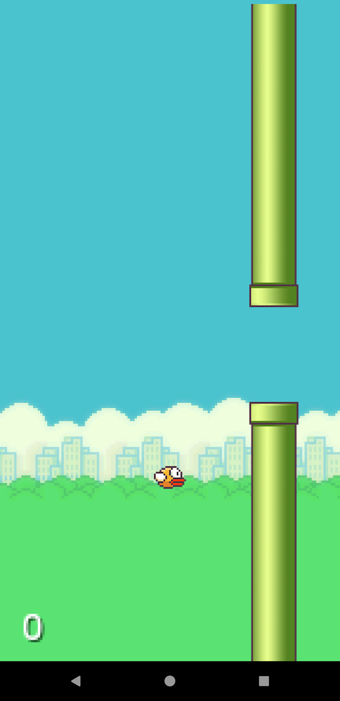

# Flappy Bird
Clone of famous game, Flappy Bird.
A simple 2D game, where the task is to keep moving forward while dodging pipes. 
Enjoy!! 🐤

### Download 
You can download the apk from [here](https://github.com/Niket-Jain/FlappyBird/releases).

### Contribute 
You can contribute to this repo by:
1. Fork this repo 🍴
2. Clone the repo to your machine. 👨‍💻
3. Submit your pull request. 🚀

### Preview 

  

  

### Upcoming features-

1- Background Sound effects
2- More Animations
3- Save your Score
4- More Game Modes
5- Better UI
